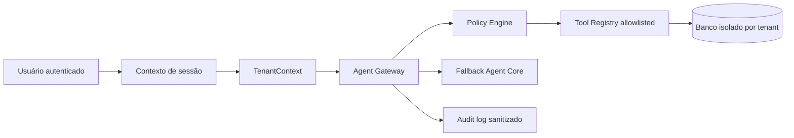

# Baseline de Arquitetura

## Propósito

Este documento descreve o estado verificável do Assistente Pastoral antes da evolução para Agent Gateway, Dashboard inteligente e Configurações administrativas. Ele é a referência de compatibilidade: nenhuma entrega posterior pode reduzir o isolamento por organização, expor transcrições, segredos ou raciocínio interno, nem eliminar o caminho atual de atendimento quando provedores novos estiverem indisponíveis.

## Componentes atuais

| Camada | Estado atual | Garantia a preservar |
|---|---|---|
| Autenticação | Manus OAuth e cookie de sessão seguro de primeira parte. | A identidade do usuário só é derivada da sessão validada pelo servidor. |
| Multi-tenant | Organizações, memberships e `organizationId` em entidades pastorais. | O cliente nunca escolhe o tenant como fonte de autoridade. |
| Chat | Conversas persistentes, propriedade por usuário e histórico isolado. | Um segundo usuário, mesmo da mesma igreja, não lê conversas alheias. |
| Agent Core | Política, ferramentas autorizadas, Model Router e fallback determinístico. | Nenhum modelo ganha acesso direto a SQL, repositórios ou rotas internas. |
| Voz | Áudio privado, transcrição interna, marcador de voz sem texto reconhecido e TTS do navegador. | Áudio e transcrição não entram em mensagens visíveis ou auditoria. |
| Auditoria | Eventos operacionais de ferramentas e voz, sem chain-of-thought. | Logs permanecem sanitizados e filtrados por tenant. |
| Dashboard | Métricas gerenciais da igreja atual e estados de carregamento, vazio e erro. | A tela continua a visão gerencial principal, não é substituída por chat. |

## Fluxos obrigatórios

O fluxo de voz utiliza a mesma cadeia depois da transcrição privada. Antes de o Gateway receber a intenção, o sistema persiste somente o marcador **Mensagem de voz**. O fluxo de texto persiste a mensagem do usuário conforme a política de conversa existente.

## Limites inegociáveis

| Limite | Regra |
|---|---|
| Banco e repositórios | Somente executores confiáveis podem acessá-los; modelos e conectores externos não recebem credenciais ou consultas livres. |
| Escritas | Exigem ferramenta cadastrada, schema validado, role autorizada, escopo derivado do servidor e confirmação quando definida pela matriz de risco. |
| Contexto de tenant | Sempre vem da membership autenticada; `organizationId` enviado pelo cliente, modelo ou provedor nunca é aceito como autoridade. |
| Segredos | Chaves, URLs sensíveis, variáveis de ambiente e objetos de erro brutos não são serializados para a UI, logs ou auditoria. |
| Automação externa | Começa desativada, allowlisted e sem URLs ou workflows arbitrários. |

## Critério de compatibilidade

Com Hermes desativado, indisponível ou inválido, o comportamento de texto e voz deve continuar a usar o Agent Core atual. O Dashboard tradicional deve continuar disponível se a camada inteligente falhar. Toda migração será aditiva e reversível logicamente por feature flag.
